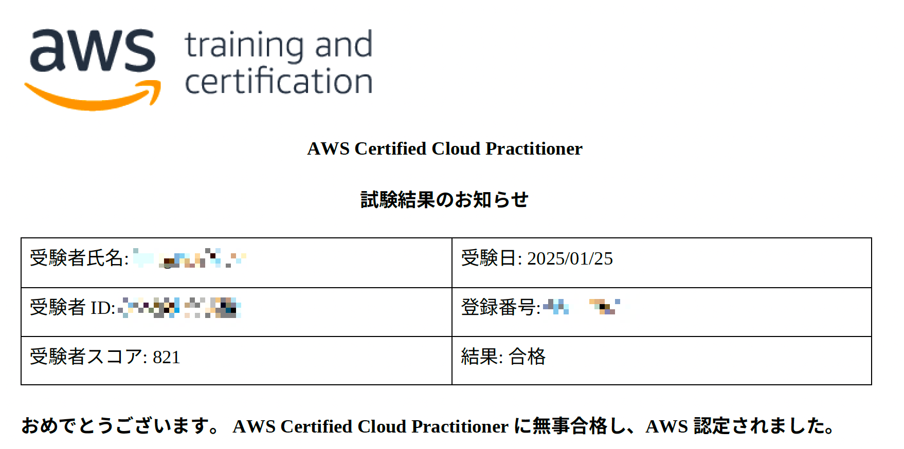

# 目的
今月にAWS Certified Cloud Practitionerを取得したので、その体験記を共有させていただきます。普段エンジニアとして働いているのでITの基礎知識はあるが、AWSのサービスに触れたことはないようなエンジニアがどれくらい学習すればいいのかを把握することを目的に書いていきます。合格証を載せておきます。

# 私のバックグラウンド
 AWSの資格取得の難易度は「どの程度AWSサービスに触れたことがあるか」で大きく学習時間などに差が着くかと思いますので、私のスペックを記載しておきます。
- 国立理系大学卒
- 経験年数３年目のエンジニア
- 所有資格は基本情報技術者と応用情報技術者のみ
- 普段はフロントとバックエンド両方の設計、開発を担当しているが実務でAWSを触った経験なし
- Udemyのハンズオンや公式チュートリアルで有名なサービスは触ったことがある程度の経験

# 経緯
今年の4月に転職することになり、転職先の会社でAWSの知識が求められる場面が多そうなので、先にAWSの資格を取得しておきたいと思いました。また個人的にも、Javaを用いたアプリケーションレイヤーの設計に関しては去年ある程度学習できたので、インフラ領域の学習も行い、システム全体の設計ができるエンジニアになりたいと思い、今年はAWSの勉強を行うことにしました。

# 学習方法
## 1.公式とUdemyのハンズオンを用いて実際にサービスを触ってみる (10時間くらい)
私の学習のスタンスとして、AWSの学習目的は「AWSを用いて設計、開発をできるようになること」であり、資格取得はあくまで副産物として捉えています。そのため、一年前にハンズオンを経験していましたが、復習も兼ねて、実際にAWSのサービスを触ってみました。公式ハンズオンも数が多いので、個人的に興味のあるサービスを使って触ってみました。

https://aws.amazon.com/jp/events/aws-event-resource/hands-on/

Udemyは以下のコースで実際にWebアプリを構築することで理解を深めました。

https://www.udemy.com/course/webapplication-on-aws/?couponCode=V2JPLETSLEARN

この講座ではEC2,VPCといったAWS上にWebアプリケーションを構築するための基礎的なサービスから、CloudWatchといった実際の運用で使用するサービスについてまで解説されており、AWSサービスに対する理解を深めることができました。試験に受かることが目的であったとしても、やはりハンズオンを一度経験しておいた方がイメージが掴めるので、一度このようなハンズオンサービスをやっておくことをオススメします。

## 2.1と並行してAWS認定資格試験テキストを流し読みする　WEB問題集をとく(合計2時間くらい)
ハンズオンを受けながら、そのハンズオンで触っているサービスの単元をAWS認定資格試験テキストで確認しました。
各サービスで聞かれるポイントはある程度決まっているので、「そのサービスで何ができるか」を理解した後は、この書籍で該当範囲を確認することで「そのサービスに対してどのようなことが問われるのか」を理解することができました。
このようにハンズオンと並行することで、ただAWS認定資格試験テキストを読むよりも理解が深まりました。

https://amzn.asia/d/8zcTGU3

また並行して以下のサイトを使って問題を解きました。

https://aws-exam.net/clf/

このサイトでそれぞれのサービスに関する問題を解いて、理解を深めました。このサイトの問題は後述のUdemyの講座の模擬試験や、実際の本番レベルに比べると「そのサービスが何か」を知っていれば解ける基礎的な問題が多い気がするので次のUdemyの講座の模擬試験を解くことをお勧めします。ただ各サービスに対する基礎的な知識を整理するにはとても役立つサイトです。

## 3.問題演習(20時間くらい)
ここまでくるとある程度各サービスに対する理解度が高くなってきたので、実際に問題演習に入ります。私も有名な以下のUdemy講座を受講しました。

https://www.udemy.com/course/aws-4260/?couponCode=V2JPLETSLEARN

この講座の模擬試験を解いて、間違えた箇所をAWS認定資格試験テキストで確認、Notionにまとめる、という流れで学習を進めました。

ここに画像を置く。

そして　模擬試験（基本レベル）は2周、模擬試験（本番レベル）は1周解きました。ちなみにそれぞれの模擬試験の正解率は以下の通りです。
|     | 1回目        | 2回目    |
| --- | --- | --- | 
|模擬試験(基本レベル①)  | 76% | 89% | 
|模擬試験(基本レベル②)  | 64% | 78% | 
|模擬試験(本番レベル①)  | 56% | 84% | 
|模擬試験(本番レベル②)  | 50% |     | 
|模擬試験(本番レベル③)  | 53% |     | 
|模擬試験(本番レベル④)  | 60% |     | 

当日の試験を受けた感覚としては模擬試験(基本レベル) < 本番 < 模擬試験(本番レベル) といった感じでした。
体感3割程度は模擬試験(本番レベル)のレベルの問題が出ていたので、模擬試験(本番レベル)までやっておくべきだと思います。

# 合計勉強時間
勉強時間は約30時間程度でした。AWS認定資格一番簡単な資格ということもあり、それほど時間をかけずに合格できました。資格取得が目的であれば、ハンズオンの時間をショートカットできるのでもう少し短くできると思います。ただ、私のようにAWSを実務で触ったことがないエンジニアは問題演習だけでなくハンズオンをやっておくことで理解が深まり次の試験の役に立つと思うので、是非ハンズオンもやっておくことをオススメします。

# まとめと今後の目標
まずは一つ資格を取得することができました。今年度はAWS Certified Machine Learning Engineer - Associate以外のアソシエイトレベルの資格は全て取得したいなと思っているので、この調子で頑張ります！。
この記事が私のようにAWSの実務経験がないエンジニアがAWSの資格を取得するための参考になれば幸いです。

